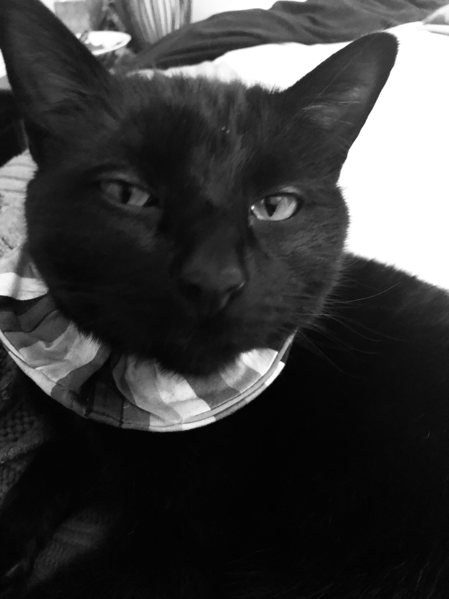

# Natalie Vaughan-Wynn

<nvwynn@uw.edu>

**[LinkedIn Profile](https://www.linkedin.com/in/natalie-v-86ba2320/)**

# Summary
>Ph.D. Student, non-profit consultant, small business owner, Returned Peace Corps Volunteer, Americorps Alum

# Work Experience

>10+ years of NGO, government, and private sector work on three continents

## University of Washington

Geography Department Pre-doctoral Teaching Associate (Fall 2020 - Present)

- **Teaching Assistant, GEOG 208**
- **Teaching Assistant, GEOG 271**
- **Teaching Assistant, GEOG 315**

## Brandeis University

MA Sustainable International Development (2009-2011)

## Eastern Washington University

BA Business Administration/Economics (1998-2004)

